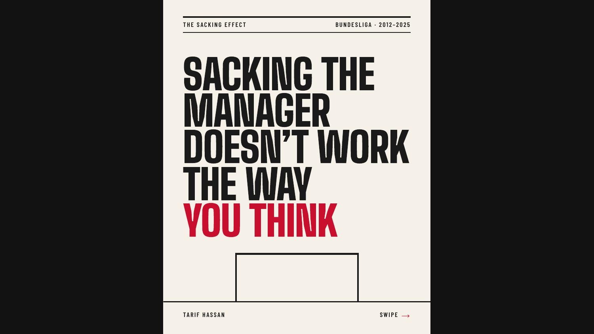
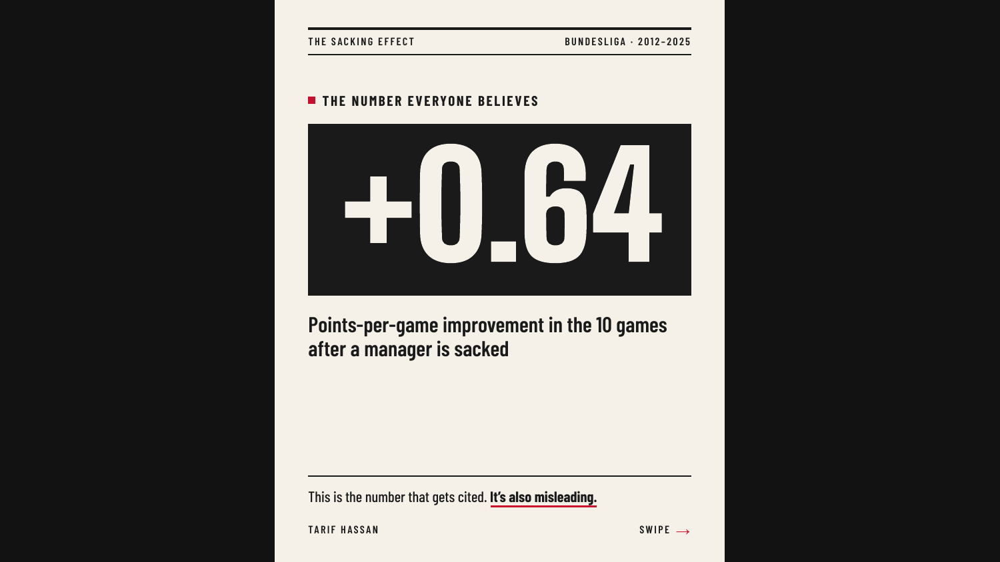
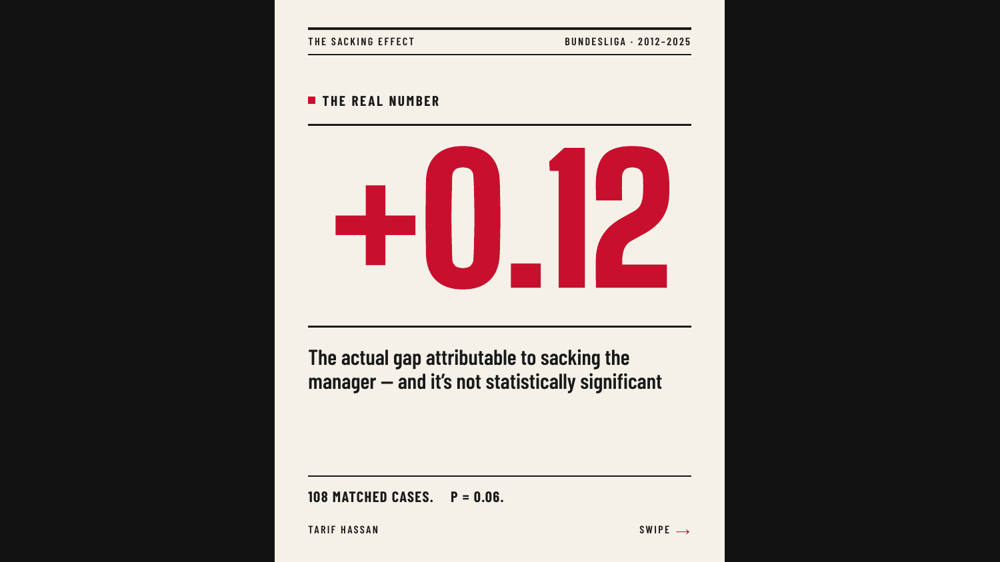
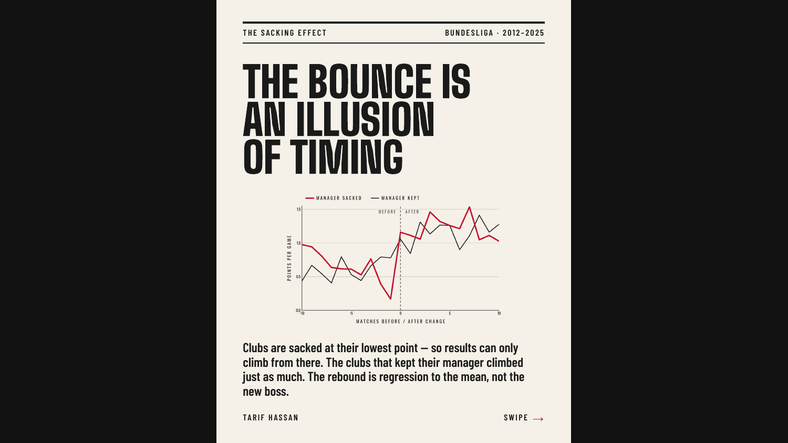
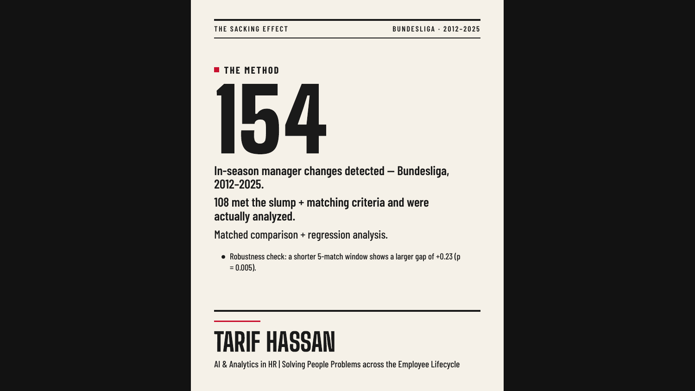

# Does Sacking the Manager Actually Work?

A data analysis of 14 seasons of Bundesliga results (2012–2025), testing
whether mid-season managerial changes produce a real performance
improvement — or whether the "new manager bounce" is mostly regression
to the mean.

## The question

Fan and media narratives treat a managerial sacking as an obvious fix
for a struggling team. But teams in a slump tend to recover somewhat on
their own, sacking or no sacking. This project isolates the effect of
the sacking itself by comparing sacked clubs to a matched group of
clubs that were in an equally bad slump but kept their manager.

## Data

- **Match results and manager records:** Transfermarkt open dataset
  (`dcaribou/transfermarkt-datasets`, mirrored on Kaggle as
  `davidcariboo/player-scores`)
- **Scope:** Bundesliga, 2012/13–2025/26 (14 complete seasons, 88,958
  total matches in the source, 4,284 Bundesliga matches)
- Cross-checked against football-data.co.uk and Wikipedia season pages

## Method

1. Built a match spine: one row per club per match, with points and
   rolling points-per-game (PPG) over the prior 10 and next 10 matches.
2. Detected 154 in-season managerial changes via manager-name changes
   between consecutive matches; excluded 5 changes on the final 1–2
   matchdays as likely end-of-season bench handoffs rather than real
   sackings.
3. Defined a "slump" as PPG ≤ 1.0 over the prior 10 matches — locked
   before computing any outcome (see `phase4_definitions.md`).
4. Matched each real slump-sacking (108 events) to the closest
   comparable club-season that stayed in a slump but did not change
   manager, on PPG and league position.
5. Compared PPG change (next 10 − prior 10) between the two groups,
   using a paired t-test and a difference-in-differences regression.

## Result

| | PPG change (next 10 − prior 10) |
|---|---|
| Manager sacked | +0.643 |
| Manager kept | +0.526 |
| **Gap attributable to sacking** | **+0.117** (p = 0.061, not significant) |

Both groups recovered substantially on their own — most of the "bounce"
fans attribute to a new manager happens regardless of whether the
manager actually changes. The sacking adds a further ~0.12 points per
game on top of that, but this could plausibly be chance at this sample
size (108 matched pairs).

**Robustness check:** using a shorter 5-match window instead of 10, the
gap widens to +0.225 and becomes statistically significant (p = 0.005).
This suggests any real effect may be front-loaded — a short-term jolt
that fades by the 10-game mark — though the 5-match PPG scale is
coarser and likely overstates matching precision. Full detail in
`sql/06_robustness.sql`.

The event-study chart below shows the actual match-by-match shape.
Sacked clubs bottom out right before the change (PPG 0.17 at match −1,
the lowest point either group reaches) and jump sharply at match 0 —
but so does the control group, and by roughly similar magnitude
(sacked: +0.57 PPG from pre- to post-change average; kept: +0.55). The
sacked line sits above the kept line in most of the first several
matches after the change, which is exactly what the "misleading"
+0.64 headline number picks up. The two lines converge once both
groups' averages are considered over the full ±10-match window — the
apparent bounce is mostly clubs recovering from their worst point,
not a new-manager effect.

## Full writeup

This result was also written up as a 6-slide carousel — full argument,
one step at a time, from the misleading +0.64 headline number to the
regression-to-the-mean explanation above. Also available as a
[PDF](deck/Manager_Sackings_Carousel.pdf).

## Repo structure

- `sql/` — build scripts, one per phase, run in order
- `data/` — exported intermediate datasets (raw CSVs excluded via
  `.gitignore`)
- `deck/` — Power BI source file (`event_study.pbix`) and the final
  carousel PDF (`Manager_Sackings_Carousel.pdf`)
- `doc-images/` — exported chart image and individual carousel slides
- `phase1_notes.md`, `phase4_definitions.md` — data-quality notes and
  the locked analysis definitions, written before results were computed

## Limitations

- Matching is with replacement (a control event could be reused across
  multiple treated cases); with 1,963 control candidates vs. 108
  treated events, this risk is low but not zero.
- League position and PPG are the only matching variables; squad
  quality, injuries, and fixture difficulty aren't controlled for.
- Bundesliga only — findings may not generalize to leagues with
  different managerial-change norms.